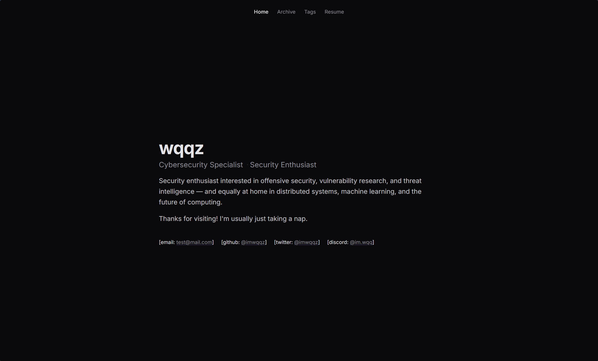

# wqqz.dev

> Highly customizable and performant portfolio template built with Astro, React, and Tailwind CSS.



## What's inside


- [Astro](https://astro.build) for static pages and content collections
- [React](https://react.dev) for the interactive bits, like the archive list and search overlay
- [Tailwind CSS v4](https://tailwindcss.com) for all the styling
- [Expressive Code](https://expressive-code.com) for highlighted code blocks, file tabs, and terminal windows
- [KaTeX](https://katex.org) so you can write math in your markdown

## Getting started

You'll need Node.js (v18 or newer) and `pnpm`.

```bash
# grab a copy of the repo
git clone https://github.com/imwqqz/wqqz.dev
cd wqqz.dev

# install the dependencies
pnpm install

# run the dev server and start editing
pnpm dev
```

Open http://localhost:4321. Add `--host` to `pnpm dev` if you want to view it from another device on your network.

## Site content

### Your personal info lives in `public/0user.json`

This is the one file you'll touch the most. It holds your name and role, the home page paragraphs, site metadata like the title and description, every contact link (email, GitHub, X, Discord), and the whole resume section.

```json
{
  "name": "wqqz",
  "contacts": [
    { "label": "email", "text": "test@mail.com", "href": "mailto:test@mail.com" }
  ]
}
```

### Blog posts live in `src/content/archives/*.md`

Each post is a plain markdown file. The frontmatter at the top tells the site what to show:

```yaml
---
title: Post title
description: Short summary shown in listings and search.
date: 2026-09-20
tags:
  - security
draft: true    # remove this (or set false) to publish the post
---
```

The easiest way to start is to copy `0-draft-1.md` or `0-draft-2.md`, fill them with your writing, and flip `draft` off when you're ready.

Some nice extras your markdown supports:

```md
> [!NOTE] / [!TIP] / [!SUCCESS] / [!IMPORTANT] / [!WARNING] / [!CAUTION]   callout boxes

```ts title="app.ts"                                   a code block with a file tab

```bash frame="terminal" group="run" tab="pnpm"          a terminal window, tabs if you group
```

## Customizing colors

The whole color scheme lives in `src/styles/global.css`, split into a light block (`:root`) and a dark block. Every color has a short comment next to it saying what it's used for, so you can just tweak the `oklch(...)` values and see the difference.

```css
--background: oklch(99% .002 286);   /* page background */
--accent:     oklch(54% .22 293);    /* highlight: links, focus */
```

The site uses JetBrains Mono for everything. That's loaded in `src/layouts/Base.astro`.

## Project structure

```
wqqz.dev/
├── public/
│   └── 0user.json          # your site info, contacts, resume
├── src/
│   ├── content/archives/   # your blog posts
│   ├── pages/              # home, archives, tags, resume, 404
│   ├── components/         # a few React and Astro components
│   ├── layouts/            # Base.astro handles the head, metadata, and fonts
│   ├── lib/                # helpers for info, archives, search, tags
│   └── styles/             # global.css holds the color tokens
├── README.md
└── LICENSE
```

> This project is licensed under the [MIT License ](LICENSE), Be nice. Details in [CODE_OF_CONDUCT.md](CODE_OF_CONDUCT.md).